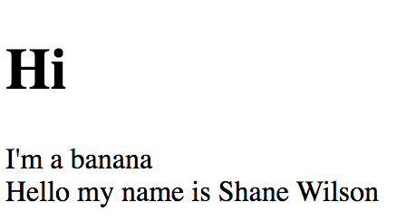

# JavaScript Functions

This project is an exploration of javascript functions.
I built an animal nugitizer. I also printed some numbers to the DOM.

## Screenshots


## How to run this project:
* Use nmp to install htpp-server:
```sh
npm install -g http-server
```

* Run the server:
```sh
hs -p 9999
```
* Open Chrome and navigate to:
```
localhost:9999
```
